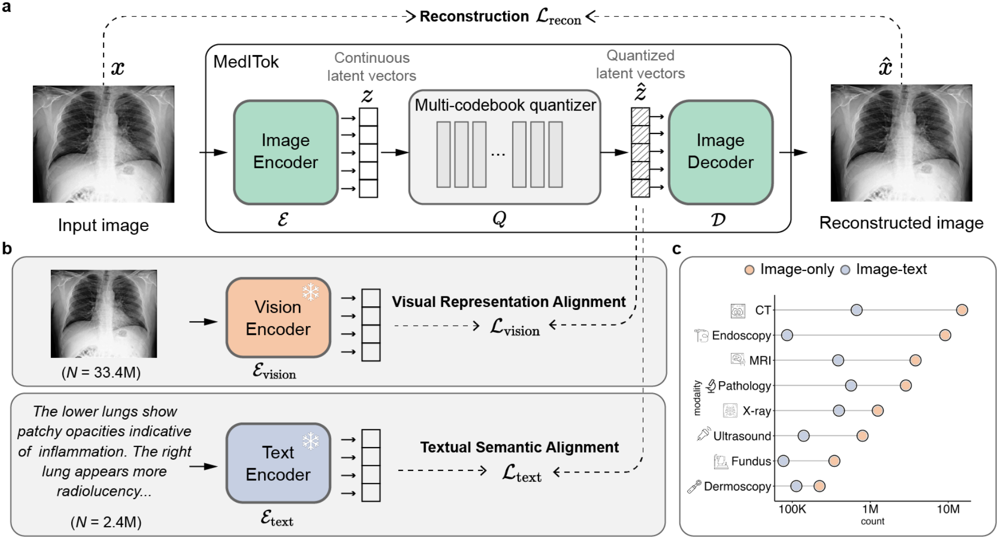

<div align="center">
<h1>
  MedITok: A Unified Tokenizer for Medical Image Synthesis and Interpretation
</h1>
</div>

<p align="center">
📝 <a href="https://arxiv.org/abs/2505.19225" target="_blank">Paper</a> • 🤗 <a href="https://huggingface.co/massaki75/meditok/tree/main" target="_blank">Hugging Face</a> • 🧩 <a href="https://github.com/Masaaki-75/meditok" target="_blank">Github</a>
</p>

This is the official repository for MedITok, a unified visual tokenizer tailored for medical image. MedITok encodes both low-level details and high-level semantics into a unified token space, and supports building strong generative models for a wide range of tasks including medical image synthesis and interpretation. 


## 📌 Overview



## 🚧 Project Status
- [x] Release [preprint](https://arxiv.org/abs/2505.19225).
- [x] Release the initial [weights](https://huggingface.co/massaki75/meditok/tree/main).
- [ ] Release training code.
- [ ] Release evaluation code.


## 🎬 Demo
1. Put the downloaded checkpoint file `meditok_simple_v1.pth` in `ckpts` folder. 
2. Create a virtual environment with core libraries listed in `requirements.txt`. 
3. Open `demo.ipynb` and click `Run All` to run the reconstruction demo. Feel free to change the images you would like to play with. 
4. Run `python demo.py` to save the reconstruction results. 


## 🙏 Acknowledgment
This project is built upon and inspired by several excellent prior works:
- [UniTok](https://github.com/FoundationVision/UniTok)
- [LlamaGen](https://github.com/FoundationVision/LlamaGen)
- [LLaVA-Med](https://github.com/microsoft/LLaVA-Med)
- ...

The model also benefits from many publicly available medical image datasets. We kindly refer readers to our preprint for details.

We sincerely thank the communities behind these works for making the resources available and inspiring further research in the field. 


## 🚀 Notes
If you build something exciting or encounter any issues when using our model, please feel free to open an issue, submit a pull request, or contact us with feedback. Your contributions and insights are highly valued!


## 📖 Citation
If you find MedITok useful for your research and applications, please kindly cite our work:
```
@article{ma2025meditok,
  title={MedITok: A Unified Tokenizer for Medical Image Synthesis and Interpretation},
  author={Ma, Chenglong and Ji, Yuanfeng and Ye, Jin and Li, Zilong and Wang, Chenhui and Ning, Junzhi and Li, Wei and Liu, Lihao and Guo, Qiushan and Li, Tianbin and He, Junjun and Shan, Hongming},
  journal={arXiv preprint arXiv:2505.19225},
  year={2025}
}
```


